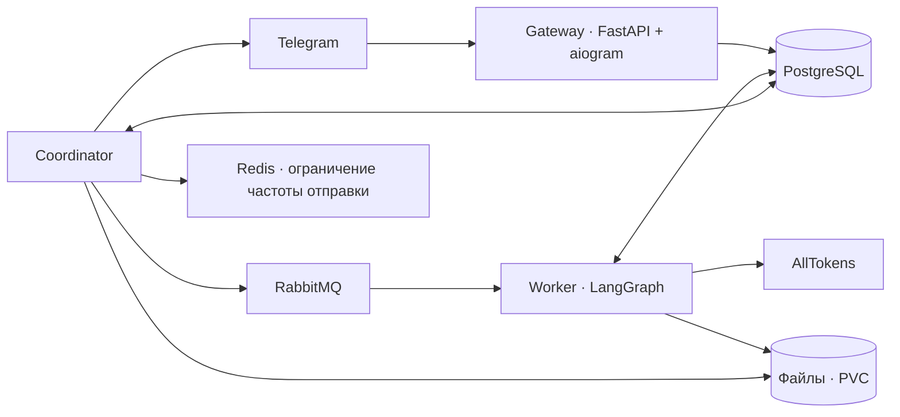

# Cronos

Личный AI-агент в Telegram для повседневной жизни, работы и творчества. Помнит предпочтения между темами, использует инструменты и может сам продолжить согласованный разговор.

## Первый запуск

Бот: [@cronos_ait_bot](https://t.me/cronos_ait_bot).

Нажми **Start**: появится отдельный чат **🪐 Cronos** с закреплённым приветствием и главным меню. Кнопка «➕ Новый чат» внутри меню запускает новый разговор; экран показывает активные проекты, следующие шаги и недавние результаты. Остальные кнопки показывают чаты, задачи, тариф, гайд, память и настройки. `/menu` или сообщение «меню» возвращает к этому экрану. Внутри домашней темы тоже можно общаться обычным текстом. Саму тему можно закрепить в Telegram вручную: Bot API позволяет закрепить сообщение, но не тему в списке.

Напиши обычным текстом, например:

- «Помоги составить меню на неделю. Не люблю рыбу».
- «Я в Новосибирске. Можно писать первым, но не после десяти вечера».
- «Запомни: отвечай коротко. Что ты вообще обо мне помнишь?»
- «В пятницу в 18:00 напомни о тренировке. Перенеси на субботу».
- «Найди актуальные источники по этой теме».
- Пришли PDF, XLSX, CSV, DOCX, TXT или фото и опиши задачу.
- «Собери результат в Excel» или «Нарисуй обложку».
- «Создай отдельную тему для учёбы».
- «Покажи тарифы» — кнопки сразу повышают тестовый тариф без оплаты.

В сворачиваемой панели под полем ввода находятся **«🤖 Модель»**, **«🧠 Режим рассуждения»** и **«🗑 Удалить чат»**. Кнопок нового чата и главного меню в нижней панели нет; создание и переключение тем доступны в интерфейсе Telegram, а меню — в теме 🪐 Cronos и по `/menu`. Контекстные кнопки и подтверждения остаются под соответствующим сообщением.

`/menu`, `/new`, `/projects`, `/chats`, `/tasks`, `/plans`, `/help`, `/memory`, `/settings`, `/stop`, `/delete`, `/clearall` — дополнительные короткие команды. Большая часть управления доступна свободным текстом. Голосовые сообщения и реальная оплата будут позже. Устройство главного меню — в [docs/home.md](docs/home.md), работа с альбомами и редактированием изображений — в [docs/images.md](docs/images.md).

## Модель и рассуждение

Для всех тарифов по умолчанию выбрана **GPT-5.6 Luna**. В панели «Модель» доступны также **GPT-5.6 Terra** и **GPT-5.6 Sol**. Выбор сохраняется для пользователя и применяется к новым запросам во всех его чатах; смена тарифа его не меняет.

Режимы — **«Без рассуждения»** (по умолчанию) и **«Глубокое рассуждение»**. В глубоком режиме работает выбранная разговорная модель. Режим не переключается автоматически из-за сложности вопроса. Текущие настройки не предлагаются при каждом обычном ответе.

Изображения анализирует та же выбранная модель. Поиск, генерация изображений и названия тем используют отдельные маршруты: `MODEL_SEARCH` (Sonar), `MODEL_IMAGE` (Gemini) и `MODEL_TITLE` (Llama). Они не меняют сохранённый выбор Luna/Terra/Sol. При временном сбое разговорного запроса повтор сохраняет выбранную модель и режим.

## Личный агент: проекты, результаты и продолжение

Все восемь направлений описаны с критериями и проверками в [плане развития](docs/personal-agent-roadmap.md).

- **Проекты:** «Сохрани подготовку к экзамену как проект», «Где остановились?», «Продолжим этот проект в другом чате». Сохраняются цель, ограничения, решения и следующий шаг.
- **Память:** «Это относится только к проекту», «До конца недели я в Москве», «Исправь: теперь тренируюсь два раза в неделю». Забытая информация исключается и из производного контекста.
- **Библиотека:** «Найди прежнюю таблицу и покажи источник». Поиск по истории, файлам и проектам возвращает проверяемые выдержки. Поиск лексический с русской морфологией; изображения разбираются через отдельный инструмент.
- **Версии:** «Измени этот документ, сохранив прежний вариант», «Покажи версии», «Верни первую». Результаты хранятся отдельными файлами со связью с исходниками.
- **Повседневные сценарии:** питание и запасы продуктов, тренировки, обучение, контент и дневник самочувствия. Новые наблюдения меняют дальнейший план; прогресс опирается на сообщённые данные.
- **Рецепты:** «Сохрани этот порядок как рецепт», «Повтори с новой таблицей». Рецепт хранит входы и шаги. При нехватке данных выполнение останавливается до ответа; успешное завершение подтверждается результатами инструментов.
- **Инициатива проекта:** согласованные поисковые проверки могут подготовить файл и сообщить о значимом изменении. Действуют разрешённые инструменты, тихие часы, частота, бюджет и отмена. Обычные расписания сохраняют прежнее поведение.
- **Персональный 🪐 Cronos:** карточки активных проектов, недавние текущие версии результатов, создание чата проекта и скрытие предложений. Начать можно с обычной просьбы, без обязательной анкеты.

## Несколько чатов

Отдельные разговоры реализованы через native private topics Telegram. Создать тему можно в интерфейсе Telegram, командой `/new` или кнопкой «➕ Новый чат» внутри домашнего меню; `/chats` показывает сохранённые названия, а переключение происходит в штатном списке тем Telegram. История у каждой темы своя. Память может относиться ко всему аккаунту, проекту или одному чату; временным фактам можно задать срок. Проект связывает несколько чатов только по явному запросу.

Название рабочего чата появляется в фоне после первой пары «вопрос — ответ», затем обновляется на отметках 10, 20, 30… сохранённых сообщений пользователя и ассистента суммарно. Используется отдельная маленькая модель `MODEL_TITLE` (по умолчанию Llama 3.1 8B Instruct). Ручное название закрепляется и больше автоматически не меняется. Домашняя тема сохраняет имя **🪐 Cronos**. Новые сервисы для этого не нужны.

Для Cronos включены темы и создание чатов пользователем из интерфейса Telegram: 7 сентября 2026 `getMe` подтвердил `has_topics_enabled=true` и `allows_users_to_create_topics=true`. Кнопка и `/new` также работают. Подробности и результаты проверки — в [docs/topics.md](docs/topics.md).

Кнопка «🗑 Удалить чат», `/delete` или просьба «удали этот чат» сначала показывают подтверждение, затем удаляют тему, её историю и задания. Общая память и библиотека файлов сохраняются. `/clearall` или «полностью очисти мои данные» удаляют также память, настройки, файлы и все остальные чаты. Тариф, баланс и учтённые расходы сохраняются. Подтверждение действует 15 минут; отмена доступна кнопкой или словом «отмена».

Telegram позволяет удалить тему целиком. В общем чате сообщения старше 48 часов бот удалить не может; их нужно очистить в Telegram вручную. Полная история внутри Cronos удаляется независимо от этого ограничения. Состав очистки и восстановление после сбоя описаны в [docs/privacy.md](docs/privacy.md).

## Устройство

Один Python-пакет, три процесса:



- PostgreSQL хранит входящие события, историю, общую память, расписания, LangGraph checkpoints, операции, исходящие сообщения и расчёты. RabbitMQ ускоряет доставку событий; сканирование PostgreSQL восстанавливает обработку при потере уведомления.
- Gateway сохраняет Telegram update и offset атомарно; после очистки отбрасывает устаревшие события и удалённый контекст вложенных ответов. Lease не позволяет двум poller подтверждать разные пачки одновременно.
- Worker сериализует действия одного пользователя, восстанавливает граф после сбоя и проверяет поколение запуска перед записью checkpoint и постановкой ответа в очередь.
- Каталог `capabilities.py` описывает схемы инструментов и собственные возможности агента. `skill_info` возвращает подробные инструкции навыка.
- Поиск вызывает проверенный нативный поиск Sonar и требует источники. Он не зависит от выбранной пользователем разговорной модели.
- Разговорные модели и нормализация старых предпочтений описаны в `model_preferences.py`: выбор вне текущего списка Luna/Terra/Sol использует Luna. Для GPT режимы переводятся в `reasoning_effort=none/high`. Перегрузка модели (HTTP 429) обрабатывается ограниченными повторами с задержкой и учётом `Retry-After`.
- Coordinator проверяет отмену/перенос перед отправкой. Для инициативных сообщений действуют согласие, тихие часы и суточная частота. Явные напоминания исполняются в назначенное время.
- Worker и Coordinator имеют общий файловый PVC и работают в одном pod. Метаданные и извлечённый текст принадлежат пользователю в PostgreSQL.

## Разработка

Python 3.14, uv 0.8.22, зафиксированный `uv.lock`.

```sh
uv sync --locked
uv run ruff check src tests
uv run ty check src
uv run pytest -q
```

Для интеграционных тестов нужен PostgreSQL с отдельным владельцем схемы и ролью `cronos_app`. `DATABASE_URL` — URL прикладной роли, `ADMIN_DATABASE_URL` — URL миграционной роли. Создать схему `langgraph AUTHORIZATION cronos_app`, затем:

```sh
uv run python -m cronos.storage
uv run pytest -q
```

Без DB-переменных интеграционные тесты явно пропускаются. Для рабочей среды также нужны `TELEGRAM_BOT_TOKEN`, `TELEGRAM_PROXY`, `ALLTOKENS_API_KEY`, `ALLTOKENS_BASE_URL`, `RABBITMQ_URL`, `REDIS_URL`, `ARTIFACTS_DIR`. Секреты передаются окружением, `.env` не читается.

```sh
uv run python -m cronos.gateway
uv run python -m cronos.worker
uv run python -m cronos.coordinator
```

В текущем macOS окружении установлены x86_64 native wheels: локальные проверки запускаются через `arch -x86_64 .venv/bin/python`. `scripts/run_local.py` подключает локальные credentials и Kubernetes Secret в окружение процесса без вывода значений; PostgreSQL ожидается на локальном port-forward `15432`. Этот helper предназначен только для текущего рабочего окружения.

## Учёт и альфа

Расчёты хранятся в целых миллионных долях рубля. 1 Cronos token = 0,001 ₽. Фактический usage провайдера сохраняется отдельно от ограниченного списания из резерва; неизвестная стоимость помечается для сверки и не объявляется нулевой.

`ALPHA_SOFT_LIMITS=true`: баланс может уходить ниже нуля, разговор не блокируется тарифом. FREE — дневной бюджет, платные тестовые планы — месячный. Повторное нажатие кнопки не начисляет пакет заново. Пополнения учитываются отдельно и не истекают вместе с периодом. Реальных платёжных запросов нет.

Технические ограничения одного запуска и ресурсов pod защищают сервис от бесконечного цикла; они не являются платным тарифным барьером.

## Эксплуатация

Развёртывание описано в [README-deployment.md](README-deployment.md), инфраструктура — в [k8s/infra/README.md](k8s/infra/README.md). Изменения применяются только в `yc-gradius / cronos-bot`.

У Telegram нет idempotency key для отправки: при разрыве связи после успешной доставки, но до подтверждения, редкий дубль возможен. Подтверждённые части длинного сообщения сохраняются отдельно и повторно не отправляются. Ошибки провайдера не должны повторять уже подтверждённые действия.

В текущем кластере NetworkPolicy не применяется сетевым плагином. Проверены namespace, ResourceQuota/LimitRange, отдельные учётные данные, ограниченный ServiceAccount и Pod Security; межпространственную сетевую изоляцию это не обеспечивает. Подробное фактическое подтверждение — в инфраструктурном отчёте.
