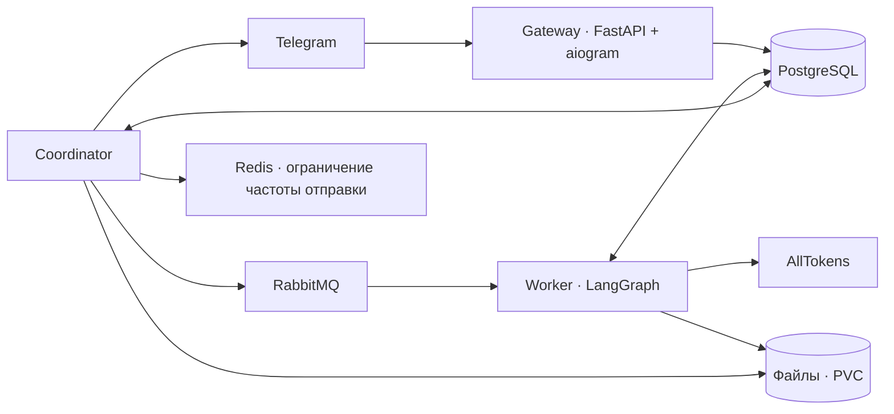

# Cronos

Личный AI-агент в Telegram для повседневной жизни, работы и творчества. Помнит предпочтения между темами, использует инструменты и может сам продолжить согласованный разговор.

## Первый запуск

Бот: [@cronos_ait_bot](https://t.me/cronos_ait_bot).

Напиши обычным текстом, например:

- «Помоги составить меню на неделю. Не люблю рыбу».
- «Я в Новосибирске. Можно писать первым, но не после десяти вечера».
- «Запомни: отвечай коротко. Что ты вообще обо мне помнишь?»
- «В пятницу в 18:00 напомни о тренировке. Перенеси на субботу».
- «Найди актуальные источники по этой теме».
- Пришли PDF, XLSX, CSV, DOCX, TXT или фото и опиши задачу.
- «Собери результат в Excel» или «Нарисуй обложку».
- «Создай отдельную тему для учёбы» (нужно включить Topics в BotFather).
- «Покажи тарифы» — кнопки сразу повышают тестовый тариф без оплаты.

`/start`, `/stop`, `/upgrade`, `/new`, `/chats` — дополнительные короткие команды. Большая часть управления доступна свободным текстом. Голосовые сообщения и реальная оплата будут позже.

## Несколько чатов

В коде реализованы отдельные разговоры через native private topics Telegram. После включения режима тем `/new` и кнопка «➕ Новый чат» создают тему; `/chats` показывает сохранённые названия, а переключение происходит в штатном списке тем Telegram. История у каждой темы своя, память и предпочтения пользователя общие.

Название появляется в фоне после первой пары «вопрос — ответ», затем обновляется на отметках 10, 20, 30… сохранённых сообщений пользователя и ассистента суммарно. Используется отдельная маленькая модель `MODEL_TITLE` (по умолчанию Llama 3.1 8B Instruct). Ручное название закрепляется и больше автоматически не меняется. Новые сервисы для этого не нужны.

**Внешняя настройка ещё нужна:** последний `getMe` от 6 сентября 2026 вернул `has_topics_enabled=false` и `allows_users_to_create_topics=false`. В BotFather требуется включить Topics Mode; для создания тем пользователем через интерфейс Telegram — отдельно разрешить такое создание. Пока режим выключен, обычный разговор работает, а создание темы сообщает о недоступности. Проверка полного сценария в живом интерфейсе Telegram ещё не выполнена. Подробности реализации и активации — в [docs/topics.md](docs/topics.md).

## Устройство

Один Python-пакет, три процесса:



- PostgreSQL хранит входящие события, историю, общую память, расписания, LangGraph checkpoints, операции, исходящие сообщения и расчёты. RabbitMQ ускоряет доставку событий; сканирование PostgreSQL восстанавливает обработку при потере уведомления.
- Gateway сохраняет весь Telegram update и offset атомарно. Lease не позволяет двум poller подтверждать разные пачки одновременно.
- Worker сериализует действия одного пользователя, восстанавливает граф после сбоя и проверяет поколение запуска перед записью checkpoint и постановкой ответа в очередь.
- Каталог `capabilities.py` одновременно описывает доступные модели инструментов и собственные возможности агента. `skill_info` возвращает подробные инструкции навыка.
- Поиск вызывает проверенный нативный поиск Sonar и требует источники. Он не зависит от выбранной пользователем разговорной модели.
- Базовая модель альфы для всех тарифов — DeepSeek V4 Flash; Qwen используется для vision. Перегрузка модели (HTTP 429) обрабатывается ограниченными повторами с задержкой и учётом `Retry-After`.
- Coordinator проверяет отмену/перенос перед отправкой. Для инициативных сообщений действуют согласие, тихие часы и суточная частота. Явные напоминания исполняются в назначенное время.
- Worker и Coordinator имеют общий файловый PVC и работают в одном pod. Метаданные и извлечённый текст принадлежат пользователю в PostgreSQL.

## Разработка

Python 3.14, uv 0.8.22, зафиксированный `uv.lock`.

```sh
uv sync --locked
uv run ruff check src tests
uv run ty check src
uv run pytest -q
```

Для интеграционных тестов нужен PostgreSQL с отдельным владельцем схемы и ролью `cronos_app`. `DATABASE_URL` — URL прикладной роли, `ADMIN_DATABASE_URL` — URL миграционной роли. Создать схему `langgraph AUTHORIZATION cronos_app`, затем:

```sh
uv run python -m cronos.storage
uv run pytest -q
```

Без DB-переменных интеграционные тесты явно пропускаются. Для рабочей среды также нужны `TELEGRAM_BOT_TOKEN`, `TELEGRAM_PROXY`, `ALLTOKENS_API_KEY`, `ALLTOKENS_BASE_URL`, `RABBITMQ_URL`, `REDIS_URL`, `ARTIFACTS_DIR`. Секреты передаются окружением, `.env` не читается.

```sh
uv run python -m cronos.gateway
uv run python -m cronos.worker
uv run python -m cronos.coordinator
```

В текущем macOS окружении установлены x86_64 native wheels: локальные проверки запускаются через `arch -x86_64 .venv/bin/python`. `scripts/run_local.py` подключает локальные credentials и Kubernetes Secret в окружение процесса без вывода значений; PostgreSQL ожидается на локальном port-forward `15432`. Этот helper предназначен только для текущего рабочего окружения.

## Учёт и альфа

Расчёты хранятся в целых миллионных долях рубля. 1 Cronos token = 0,001 ₽. Фактический usage провайдера сохраняется отдельно от ограниченного списания из резерва; неизвестная стоимость помечается для сверки и не объявляется нулевой.

`ALPHA_SOFT_LIMITS=true`: баланс может уходить ниже нуля, разговор не блокируется тарифом. FREE — дневной бюджет, платные тестовые планы — месячный. Повторное нажатие кнопки не начисляет пакет заново. Пополнения учитываются отдельно и не истекают вместе с периодом. Реальных платёжных запросов нет.

Технические ограничения одного запуска и ресурсов pod защищают сервис от бесконечного цикла; они не являются платным тарифным барьером.

## Эксплуатация

Развёртывание описано в [README-deployment.md](README-deployment.md), инфраструктура — в [k8s/infra/README.md](k8s/infra/README.md). Изменения применяются только в `yc-gradius / cronos-bot`.

У Telegram нет idempotency key для отправки: при разрыве связи после успешной доставки, но до подтверждения, редкий дубль возможен. Подтверждённые части длинного сообщения сохраняются отдельно и повторно не отправляются. Ошибки провайдера не должны повторять уже подтверждённые действия.

В текущем кластере NetworkPolicy не применяется сетевым плагином. Проверены namespace, ResourceQuota/LimitRange, отдельные учётные данные, ограниченный ServiceAccount и Pod Security; межпространственную сетевую изоляцию это не обеспечивает. Подробное фактическое подтверждение — в инфраструктурном отчёте.
