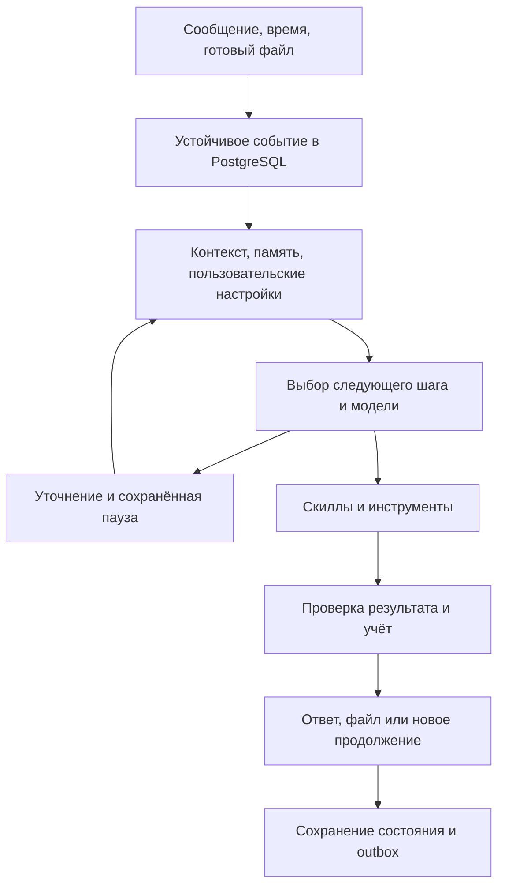

# Cronos: технический план MVP

Статус: утверждён пользователем; реализация начата. Сначала разворачивается инфраструктура в `cronos-bot`, затем продуктовые компоненты.

Дополнения при старте реализации: агент получает компактный каталог своих возможностей в контексте и инструмент получения подробного описания скилла; поиск использует реальный web-search маршрут с проверенной поддержкой; в alpha тариф можно повысить одной кнопкой с замоканной оплатой, без жёсткой остановки общения по балансу. Кнопка тарифа — явно согласованное дополнение к основному управлению через свободный текст. Дефицит отражается в учёте, а расходы провайдера и инфраструктурные ограничения продолжают контролироваться сервисом.

Основание: согласованная концепция универсального персонального агента в Telegram; исследование API и локального `../core` от 05.09.2026. Репозиторий Cronos пока без коммитов, ветка `main`. Референс `../core`: `dev`, коммит `0bf81178`; изменения в него не вносятся.

## 1. Результат MVP и принятые решения

Cronos помогает в повседневных и рабочих вопросах, постепенно узнаёт пользователя, сохраняет контекст разных бесед, применяет инструменты и самостоятельно возвращается к актуальным намерениям. Напоминание — первый скилл проактивности. Архитектура не привязана к планировщику задач как основному продукту.

Управление через обычный текст. Кнопки и slash-команды не являются обязательным маршрутом для памяти, настроек, тарифов, создания бесед и управления фоновыми действиями. Нативные элементы Telegram, включая начальный Start и остановку генерации, допустимы.

Зафиксировано пользователем:

- Python, FastAPI, aiogram, LangGraph; PostgreSQL для данных MVP.
- Общая БД со строгой изоляцией пользователей. ClickHouse откладывается; статистика и архив диалогов на старте также в PostgreSQL.
- AllTokens как провайдер моделей; смена провайдера не меняет доменные сущности и баланс.
- FREE: 25 ₽ бюджета в день; START: 700 ₽, PREMIUM: 1700 ₽, PRO: 3700 ₽ в месяц. Будущие цены подписок: 990/1990/3990 ₽. Экономика сейчас не пересматривается.
- Повышение тарифа и пополнения по запросу без реальной оплаты в alpha.
- Нативные темы Telegram и Rich Messages.
- Разработка и выпуск из `main`, без преждевременного процесса feature branches/flags.
- Кластер `yc-gradius`, исключительно namespace `cronos-bot`.
- Без Vault; настройки и ключи доступны приложению через переменные окружения Deployment.
- Первые пользователи — владелец и близкий круг; приоритет — рабочая функциональность и проверяемое поведение.

В MVP входят: диалоги и темы, память и персонализация, автоматический поиск, vision, генерация и последовательная правка изображений, reasoning и уточнения, проактивные продолжения и явные напоминания, чтение/анализ/создание файлов, общий баланс и тестовые пополнения.

После MVP: голос, почта/Notion, Secretary Mode и MTProto, публичный каталог MCP/скиллов, произвольное исполнение сгенерированного кода, реклама и платежи, отдельные клинические/юридические специализированные системы. Эти направления не блокируют alpha.

## 2. Стек и структура проекта

Следуем актуальным соглашениям `../core`: Python 3.14, uv workspace и lockfile, src-layout, Pydantic Settings, асинхронный код, Ruff с длиной строки 100, ty, pytest, многоэтапный Dockerfile с непривилегированным пользователем. Совместимость зависимостей с Python 3.14 подтверждается на этапе 0.

Базовые зависимости:

- FastAPI/uvicorn; aiogram 3.31.x с поддержкой Bot API 10.3.
- LangGraph и PostgreSQL checkpointer; версии фиксируются совместно после smoke-проверки.
- OpenAI Python SDK с заменяемым `base_url`; используется подтверждённый Chat Completions API.
- SQLAlchemy 2 + asyncpg для доменных таблиц, Alembic для миграций; psycopg для LangGraph checkpointer при необходимости его адаптера.
- FastStream/aio-pika + RabbitMQ; Redis для восстанавливаемого кэша и ограничения частоты.
- Кандидаты для файлов: pypdf/pdfplumber, движок рендера PDF, openpyxl/pandas, python-docx, reportlab; конкретные версии и OCR-путь проверяются в образе.
- Структурированные логи и идентификаторы user/conversation/event/run/operation; секреты и полные документы в технические логи не попадают.

Предлагаемая структура:

```text
cronos/
  pyproject.toml, uv.lock
  gateway/src/gateway/          # FastAPI, polling, Telegram ingress
  worker/src/worker/            # агент, файлы, streaming и доставка
  coordinator/src/coordinator/  # расписания, публикация событий, recovery
  common_libs/
    domain/                    # Pydantic DTO, интерфейсы, состояния
    persistence/               # репозитории, транзакции, изоляция
    agent/                     # LangGraph, память, реестр скиллов
    providers/                 # AllTokens, search, image adapters
    billing/                   # usage, rate cards, резервы, ledger
    telegram/                  # renderer и transport
    artifacts/                 # чтение, обработка, сборка файлов
  migrations/
  tests/                       # интеграционные и сквозные сценарии
  evals/                       # русскоязычные сценарии качества агента
  .docker/, .github/workflows/, k8s/
  docs/
```

Пакеты не импортируют соседний checkout `../core`: заимствуем соглашения, необходимые адаптеры реализуем в Cronos. Состав общих библиотек можно объединить при scaffold, сохранив перечисленные границы ответственности.

## 3. Топология alpha

Три приложения, по одной реплике:

| Приложение | Работа |
|---|---|
| gateway | Приём Telegram updates, FastAPI health/internal endpoints, устойчивый курсор polling |
| worker | LangGraph, модели и инструменты, файлы, потоковые черновики, отдельный цикл постоянной доставки |
| coordinator | Расписания, outbox publisher, восстановление потерянных задач, сверка незавершённых операций |

PostgreSQL и RabbitMQ — отдельные одиночные StatefulSet с PVC. Redis — небольшой Deployment, его потеря не уничтожает пользовательское состояние.

Файлы alpha хранятся в отдельном PVC единственного worker, метаданные — в PostgreSQL. Интерфейс artifact storage изначально заменяемый. Загрузка по Telegram file_id и отправка файлов выполняются worker, поэтому gateway/coordinator не требуют доступа к диску файлов. Файлы не помещаются в checkpoints, RabbitMQ или BYTEA-колонки БД.

Worker одновременно обслуживает независимый цикл доставки и ограниченное число заданий. CPU-тяжёлая обработка файлов запускается отдельным процессом, чтобы не блокировать отправку сообщений. Горизонтальное масштабирование файловых worker откладывается до перехода на общее объектное хранилище. Для singleton worker с RWO PVC используется стратегия Recreate; задания переживают эту паузу.

### Telegram ingress

Для alpha — long polling, без публичного домена, ingress и TLS-сертификата. [aiogram polling](https://docs.aiogram.dev/en/latest/dispatcher/long_polling.html)

1. Один активный poller получает lease в PostgreSQL.
2. `getUpdates` вызывается через aiogram Bot.
3. Пачка updates, события для обработки и следующий курсор сохраняются транзакцией.
4. Следующий запрос с новым offset отправляется только после commit.
5. При сбое БД offset не продвигается. Повторные updates отсеиваются уникальным `update_id`.

Стандартный асинхронный dispatch сам по себе не считается гарантией сохранения update. Dispatcher обрабатывает уже сохранённые события. `drop_pending_updates=True` не используется. При потере lease poller прекращает запросы; Recreate дополнительно исключает обычное пересечение экземпляров при релизе.

Webhook позже подключается к тому же inbox; он не меняет агентный процесс. Ограничения срока хранения updates самим Telegram остаются внешней границей восстановления длительного простоя до приёма событий приложением.

## 4. Данные, изоляция и память

Все доменные данные находятся в PostgreSQL; миграции — явные и версионированные.

| Группа | Основные сущности |
|---|---|
| Пользователь | users, preferences, consent/policy, plan subscriptions |
| Диалог | conversations, messages, summaries, pending interactions |
| Память | memory facts, source references, interests, active intentions, exclusions |
| Исполнение | inbox events, runs, tool operations, leases, broker outbox |
| Проактивность | schedules, occurrences, initiative history |
| Доставка | message outbox, attempts, destination, Telegram message IDs |
| Файлы | artifacts, extracted chunks, provenance, processing jobs |
| Учёт | usage attempts, pricing versions, grants, reservations, ledger |
| LangGraph | Checkpointer/store schema, отделённая от доменных таблиц |

Владение задаётся `user_id` в каждой пользовательской сущности и проверяется сервером. Идентификатор пользователя не принимается от модели как доказательство доступа. Репозитории требуют owner context; RLS и роли без BYPASSRLS добавляют изоляцию доменных таблиц. Фоновые задачи получают owner context из сохранённой записи задания. Tenant-контекст устанавливается на транзакцию, не сохраняется случайно между запросами пула.

Связь беседы: внутренний `conversation_id` ↔ bot/chat/topic. `thread_id` LangGraph — внутренний UUID; доступ к нему проверяется приложением. Учитываются General topic, сообщения без thread_id, удалённые темы. Удаление темы не означает автоматическое удаление всей общей памяти пользователя.

Память разделяется на:

- историю и краткое содержание конкретной беседы;
- подтверждённые сведения и предпочтения пользователя;
- временную ситуацию и активные намерения;
- предположения, которые не становятся фактами автоматически;
- источники: сообщение, страница PDF, лист/диапазон таблицы.

Контекст собирается из последних сообщений, summary и релевантных сведений, а не из полной истории аккаунта. На старте достаточно выборки структурированных фактов и полнотекстового поиска PostgreSQL; отдельная векторная БД не нужна. Межчатовая персонализация переносит релевантные общие сведения, не сливает транскрипты всех тем.

Просмотр, изменение и забывание выполняются инструментами через свободный текст. Изменения имеют revision. При забывании удаляются соответствующие memory entries, инвалидируются производные summaries и старый активный checkpoint; исходные фрагменты исключаются из будущей сборки контекста и извлечения памяти. Запущенные задания перед отправкой проверяют revision. Удаление самой истории/файла — отдельная понятная операция. Проверяется, что забытый факт не возвращается из старого summary или фонового задания.

## 5. Единое агентное ядро



События MVP: `message_received`, `timer_fired`, `artifact_ready`, `user_cancelled`; новые типы интеграций добавляются к тому же контракту.

Алгоритм одного run:

1. Проверить владение событием, состояние беседы, отмену и незавершённое уточнение.
2. Собрать персональный и локальный контекст, доступные скиллы, настройки расходов.
3. Выбрать обычный ответ, поиск, reasoning, vision, изображение, работу с файлом или действие с памятью/расписанием.
4. При существенной неоднозначности сохранить вопрос через LangGraph interrupt и ждать продолжения без занятого worker и открытой транзакции.
5. Зарезервировать бюджет оплачиваемого шага; выполнить типизированный инструмент.
6. Проверить результат, сохранить usage и фактические изменения; только затем сообщать об успехе.
7. Сформировать ответ через общий стиль Cronos; при необходимости сохранить основание для продолжения.

Скилл содержит id/version, описание применимости, входную/выходную схему, используемые инструменты, виды побочных эффектов, правила продолжения и примеры проверки. В MVP первый отдельный проактивный скилл — reminders/follow-up. Поиск, файлы, изображения, память и тарифы представлены инструментами/возможностями общего агента. Темы «семья», «питание», «работа» не требуют отдельных сервисов и жёстких пользовательских сегментов.

Один изменяющий граф run на conversation. PostgreSQL lease с fencing token защищает от конкурирующих worker; нельзя держать SQL-транзакцию открытой на время LLM-запроса. Новые сообщения сохраняются и обрабатываются последовательно. Управление отменой, забыванием и отключением инициативы проходит коротким отдельным путём; длительное задание не блокирует эти команды. Перед новым инструментом и отправкой результата сверяется актуальность run/revision.

Надстройка над PostgreSQL checkpointer проверяет fence/lease в той же короткой транзакции, что записывает checkpoint или pending writes. Доменные изменения и создание постоянного outbox также выполняются условно при актуальном fence. Проверки только перед LLM-вызовом недостаточно: после передачи lease устаревший worker не может изменить граф или опубликовать ответ. Поздний ответ провайдера разрешено сохранить идемпотентно в журнал соответствующей попытки для учёта реальной себестоимости; он не возобновляет отменённый run. Связь checkpointer с fence проверяется отдельно на этапе каркаса.

Повторяемый LangGraph node может исполниться снова после рестарта/interrupt. Побочные эффекты получают устойчивый `operation_id`; результат инструмента хранится отдельно от checkpoint. Источники из файлов/интернета считаются данными, а не полномочиями на вызов инструментов. [Поведение interrupt](https://docs.langchain.com/oss/python/langgraph/interrupts)

## 6. Онбординг, стиль и проактивность

Первый диалог сразу помогает с реальным вопросом. Нет обязательной анкеты, выбора сегмента или обучения командам. Cronos демонстрирует разные возможности по месту и постепенно уточняет предпочтения.

Общие настройки: язык, tone of voice, детализация, IANA timezone, периоды тишины, интенсивность инициативы, темы с разрешёнными/отключёнными обращениями. Они изменяются текстом и хранятся в БД. Часовой пояс уточняется при первой задаче, где местное время влияет на результат; его нельзя молча выводить из timezone сервера.

При знакомстве Cronos один раз договаривается, что может сам возвращаться к обсуждённым вопросам. Это разрешение хранится отдельно. Явная просьба напомнить разрешает конкретное действие независимо от общего режима инициативы. После включения проактивности для каждого уместного продолжения отдельное подтверждение не требуется.

Правила alpha, предлагаемые вместе с этим планом:

- Инициатива связана с текущим намерением/ситуацией, а не с произвольным поводом для увеличения сообщений.
- Первое автоматическое продолжение после конкретного обсуждения может создаваться без слова «напомни».
- Самостоятельно назначенное продолжение по умолчанию одноразовое. Бессрочный повтор требует выраженного желания пользователя.
- Первоначальный предел — до двух инициативных обращений за локальный день, не считая явно назначенных напоминаний и ответов на пользовательские задания. Предел меняется разговором.
- После двух проигнорированных инициатив по одной теме новые автоматические обращения по ней приостанавливаются до следующего взаимодействия. Это продуктовая настройка alpha, не жёсткий сегмент.
- Периоды тишины учитываются для инициатив; явное напоминание на названное пользователем время сохраняет этот смысл.
- При срабатывании заново читаются контекст, разрешение, отмена, revision и актуальность намерения. Результат может быть «ничего не отправлять».
- Пользователь видит причину обращения в естественной формулировке; внутренние рассуждения модели в ответ не выводятся.

### Устойчивые расписания

Храним время UTC, исходную timezone, правило повторения, revision, intent/source, фиксированный текст или инструкцию динамической генерации, статус и следующий срок.

Scheduler транзакционно создаёт occurrence и событие, продвигая следующее срабатывание. Уникальность `(schedule_id, schedule_revision, scheduled_at)` предотвращает повторное создание. Ожидание не занимает активный процесс; `asyncio.sleep` не является хранилищем расписания.

Одноразовое явное напоминание после простоя досылается с понятным указанием задержки. Для пропущенных периодических напоминаний отправляется одно объединённое уведомление и рассчитывается следующий срок; очередь старых повторов не превращается в массовую рассылку. Контекстная инициатива после простоя проходит повторную оценку уместности и может быть пропущена. Произвольные естественные расписания нормализуются в поддерживаемое правило; неоднозначность уточняется.

Фиксированный текст формируется и сохраняется при создании. Доставка уже принятого простого напоминания не зависит от нового LLM-вызова или текущего баланса. Динамический follow-up резервирует доступный бюджет при срабатывании; при его нехватке явное напоминание использует сохранённый текст, необязательная инициатива может быть пропущена.

## 7. Провайдеры, модели и поиск

Доменные интерфейсы: `ModelGateway`, `SearchProvider`, `ImageProvider`. Провайдерские SDK-типы не проходят в доменную модель. AllTokens подключается по `https://api.alltokens.ru/api/v1`; ключи не включаются в исходники этого плана.

Модельные обращения AllTokens в MVP идут через `POST /chat/completions`. Для image generation/editing адаптер добавляет поддерживаемые конкретной моделью `modalities`/`image_config` и изображения на входе. Отдельный `ImageProvider` отделяет роль в приложении, не означает обязательный отдельный HTTP API. Responses API не требуется; точные payload и media output проверяются живым smoke до реализации общего маршрута.

После живой проверки 05.09.2026 базовым маршрутом альфы для всех тарифов выбран `deepseek/deepseek-v4-flash`: Nemo подтвердил запись памяти без инструмента, а Qwen вернул временную перегрузку HTTP 429. Qwen остаётся vision-маршрутом. Таблица ниже сохраняет первоначальные кандидаты исследования; фактические настройки находятся в `src/cronos/settings.py`.

| Маршрут | Первичный кандидат | Правило |
|---|---|---|
| Free text | mistralai/mistral-nemo | Обычный текст и простые tool calls |
| Free fallback 1 | meta-llama/llama-3.1-8b-instruct | Включается после проверки качества/схем |
| Free fallback 2 | inclusionai/ling-3.0-flash | Кандидат; более дорогой output, проверяется в том же бюджетном коридоре |
| Vision / бюджетный reasoning | qwen/qwen3.7-flash | По наличию изображения или требованиям задачи |
| Paid text / reasoning | qwen/qwen3.7-flash, deepseek/deepseek-v4-flash | Выбор по задаче и настройкам расходов |
| Image generation/edit | google/gemini-3.1-flash-image-preview | Изображение выдаётся реальным media artifact |
| Search | perplexity/sonar | Поисковый адаптер возвращает содержимое и ссылки |

Это кандидаты из публичного каталога, а не обещание измеренного равного качества. На этапе 0 подтверждаются доступность по ключу, точные API-параметры, счётчики, стоимость и поддержка инструментов. Неподходящий fallback заменяется после проверки кандидата того же бюджета; требование равного качества не считается выполненным по одному названию модели. [AllTokens models](https://docs.alltokens.ru/api/models/)

Поиск выполняется автоматически, если нужна актуальная/проверяемая информация. Перед поиском краткий статус, в ответе — ссылки. При отсутствии источников бот не сообщает, что сведения проверены. Sonar — первый путь без нового API-ключа; если фактический endpoint не возвращает пригодные результаты/источники, это отдельный выявленный блокер search, а не имитация поиска обычной LLM. Интерфейс позволяет подключить другой поисковый сервис.

Reasoning включается только для поддерживающего его маршрута. В пользовательских настройках — автоматический подбор, предпочтение экономии/качества, максимальная стоимость задачи и возможность ручного выбора. Дорогой выход за согласованный предел сначала получает подтверждение конкретного объёма; уточнение и подтверждение сохраняются через interrupt.

Встроенные повторы SDK отключены. Не более трёх обращений приложения в одной цепочке восстановления: основная попытка и два fallback. У каждого run общий бюджет шагов/времени; точные рабочие значения определяются smoke-проверкой. Сетевой timeout после отправки не является основанием немедленно сделать дорогой дубль. Число внутренних upstream-попыток агрегатора отдельно не гарантируется приложением.

## 8. Тарификация и тестовые изменения лимитов

В интерфейсе одна единица: **токен Cronos**. Предлагаемая фиксированная конверсия alpha: **1 токен = 0,001 ₽ расчётного ресурсного бюджета**. В справке прямо поясняется отличие от буквального токена конкретной модели.

| План | Начисление | Будущая цена |
|---|---:|---:|
| FREE | 25 000 токенов ежедневно | Бесплатно |
| START | 700 000 токенов за месяц | 990 ₽ |
| PREMIUM | 1 700 000 токенов за месяц | 1990 ₽ |
| PRO | 3 700 000 токенов за месяц | 3990 ₽ |

Расчёты ведутся в integer микрорублях/Decimal, без float. Округление отображения не создаёт дополнительного списания за каждый маленький внутренний шаг.

Храним raw usage и нормализованные input/output/cache/reasoning, стоимость tools, модель/маршрут, generation ID, версию rate card, валюту и статус сверки. Нельзя предполагать валюту raw `usage.cost` или суммировать reasoning/cache с total повторно. Тарифы изображений и поиска проверяются по фактическим измерениям; «цена за image unit» не трактуется как цена одной готовой картинки.

CPU-seconds, RAM-GB-seconds, объём файлов, duration и метод оценки сохраняются на задачу. Для общего worker часть атрибуции оценочная и помечается как таковая. На alpha коэффициенты дополнительного списания CPU/RAM/хранения равны нулю до калибровки; LLM и тарифицируемые внешние tools списываются по проверенным ставкам. Возможность включить compute в тот же баланс закладывается без второй пользовательской валюты. Ожидание до срока напоминания не считается compute.

Протокол списания:

1. Атомарный резерв перед каждой оплачиваемой попыткой в пределах общего разрешённого бюджета run.
2. Собственный attempt/operation ID; повторная обработка не создаёт ещё один резерв.
3. Settlement по подтверждённому usage, возврат неиспользованного резерва.
4. Отмена до отправки освобождает резерв. После отправки неизвестный результат остаётся на сверке, отмена не означает нулевой расход провайдера.
5. Generation ID используется для сверки. Если провайдер не позволяет восстановить стоимость за 24 часа, резерв пользователя освобождается, неизвестная себестоимость записывается как расход alpha, поздний ответ не приводит к неожиданному списанию сверх освобождённого бюджета.
6. Внутренние повторные попытки после ошибки учитываются как себестоимость проекта; за одну завершённую логическую операцию пользователь не получает повторное списание за инфраструктурные сбои. Частично выполненные полезные этапы и добровольно остановленная генерация учитываются по подтверждённому usage в рамках показанного бюджета.

Если фактическая стоимость оказалась выше резерва, пользовательское списание ограничивается резервом. Превышение относится на расход проекта и вызывает проверку rate card. Следующий шаг требует нового резерва; превышение общего согласованного бюджета задачи требует сохранённого подтверждения пользователя. Зарезервированная сумма и максимально допустимое списание доступны агенту для объяснения до запуска.

Правила периодов alpha:

- FREE начисляется в 00:00 UTC; локальное время следующего начисления показывается в ответе. Смена timezone не создаёт новую выдачу. Неиспользованный дневной grant истекает.
- Платный месяц считается от момента активации в UTC, с сохранением исходного дня привязки и корректным поведением коротких месяцев.
- FREE→paid открывает платный период, бесплатный остаток не переносится; ежедневная бесплатная субсидия платному аккаунту дополнительно не начисляется.
- Upgrade внутри периода начисляет положительную разницу между новым entitlement и максимальным уже начисленным entitlement этого периода, повторный переход туда-обратно не выдаёт её заново. Downgrade вступает в силу со следующего периода.
- Плановые grants уникальны по пользователю/периоду/типу; пополнения — отдельный неистекающий баланс alpha. Сначала расходуется истекающий grant, затем top-up.
- Пополнение/upgrade выполняются только по явному запросу пользователя, без эквайринга, маркируются `test`. Если количество пополнения не названо, уточняется. Автоматического бесконечного пополнения при нуле нет.
- Поздний settlement или возврат относится к исходному резерву/периоду. Пользователь может спросить остаток, историю, лимит и дату обновления обычным текстом.

## 9. Файлы и Telegram-ответы

Поддерживаем первые стандартные форматы: PDF, CSV, XLSX и DOCX, а также изображения. Пользователь может задать вопрос по файлу, попросить сравнение/расчёт/преобразование и получить новый файл. Семантику запроса выбирает агент; сами расчёты и сериализацию выполняют проверяемые инструменты.

Обработка: download → определение типа → извлечение текста/таблиц → сохранение структуры и source references → анализ/расчёт → сборка результата → проверка → отправка. Для сканов нужен OCR/vision-путь; он входит в smoke-проверку файлового контура, а не заменяется заявлением о прочитанном пустом PDF. Большие документы обрабатываются частями, а не целиком передаются в prompt.

Файлы, загружаемые в alpha, не ограничиваются искусственными продуктовыми тарифами. Реальные ограничения Telegram/API, памяти и времени выполнения остаются; ошибки объясняются, частичное прочтение обозначается. Формат, который невозможно корректно обработать, не выдаётся за поддержанный. Legacy DOC/XLS и специализированные форматы подключаются по фактической потребности; базовая приёмка обязательна для PDF/CSV/XLSX/DOCX.

Произвольный код модели не исполняется. Для анализа таблиц есть библиотека типизированных операций: фильтрация, агрегация, join, сортировка, арифметика, построение таблицы/графика. Этого достаточно для первого универсального файлового workflow; будущая sandbox расширит доступные вычисления.

Выходы: текст, таблицы/графики, XLSX/CSV, DOCX/PDF, изображения. Таблицы проверяются по исходным данным и независимым контрольным значениям; DOCX/PDF открываются/рендерятся для проверки кириллицы, страниц и обрезаний. Полученный файл не объявляется готовым до успешной записи и проверки.

Финализация artifact: временный файл на PVC → проверка структуры/размера/checksum → fsync и атомарное переименование в окончательный путь → транзакция PostgreSQL со статусом `ready`, событием `artifact_ready` и необходимым outbox. Recovery различает незавершённый файл, готовый файл без записи БД и запись БД без файла. Сироты очищаются только после периода восстановления и проверки ссылок; ожидающая отправка защищает файл от очистки. Missing artifact переводит доставку в восстанавливаемую ошибку, а не в успех.

Telegram renderer принимает типизированное дерево ответа: текст, таблица, цитата, spoiler, code, media, ссылка на artifact. Structured rich blocks используются для сложных ответов, обычные сообщения — для коротких. HTML от модели напрямую не отправляется; URL/текст экранируются. Для несовместимого rich payload предусмотрены обычный текст и приложения.

Темы создаются и выбираются текстом. Потоковый черновик — временный preview, итог сохраняется в постоянный outbox. Статусы «ищу», «анализирую», «создаю файл» краткие; служебная маршрутизация не загромождает диалог. Stop в Telegram и фразы об отмене останавливают дальнейшие шаги, не обещая отмену уже завершённого внешнего расхода.

## 10. Доставка, сбои и эксплуатация

PostgreSQL — источник устойчивых событий. RabbitMQ передаёт `event_id`, не является единственным местом хранения задания. Outbox publisher использует publisher confirms; consumer — manual acknowledgements после устойчивого результата/состояния ожидания. Recovery регулярно восстанавливает события без завершённого run и истёкшие leases. Долгие файлы/генерации не держат Rabbit delivery бесконечно: принятие оформляется устойчивым lease, выполнение восстанавливается по БД.

Постоянные ответы и напоминания имеют destination, payload/artifact reference, attempts, next retry, lease и Telegram message_id. Sender учитывает 429/retry_after, ограничение частоты, недоступность сети и блокировку бота. Отправка в удалённую тему обрабатывается явно: для напоминания возможна доставка в основной личный диалог с пояснением; другие ответы не теряются молча.

Невозможно обеспечить математическое exactly-once внешней отправки Telegram при потере ответа после приёма сообщения. Такие попытки записываются как неопределённые, отдельно обрабатываются и могут привести к редкому дублю при повторе. Гарантия Cronos — долговечность принятого задания, восстановление, наблюдаемые ошибки и отсутствие повторного финансового эффекта от повторного события.

Нужные метрики без отдельной тяжёлой observability-платформы: queue age, число активных/ошибочных runs, scheduler lag, delivery lag/errors, provider latency/errors, usage и стоимость по маршрутам, pending reconciliation. История использования хранится в PostgreSQL и доступна владельцу через внутренний инструмент/CLI; публичная админка не входит в MVP.

Readiness проверяет необходимые локальные зависимости, не делает платный вызов модели. Graceful shutdown прекращает захват новых задач и оставляет восстанавливаемое состояние незавершённых. Backup PostgreSQL и файлов создаётся согласованно и проверяется восстановлением; один PVC не считается резервной копией. Хранение резервной копии на том же кластере защищает от ошибок приложения, но не заявляется как защита от потери всего кластера.

## 11. Kubernetes и CI/CD

Первый шаг реализации: исключить `credentials`, локальные артефакты и секретные материалы из Git и Docker context до первого commit/build. Приложения получают конфигурацию через env Deployment, без Vault. Значения секретов не печатаются в CI; источники конфигурации и runtime env проверяются без вывода значений.

CI использует существующие `YC_JSON_CREDENTIALS` и `KUBE_CONFIG`; наличие, формат и права проверяются на этапе 0, названия не заменяются догадками по соседнему репозиторию. Ключи Telegram/AllTokens для runtime подаются из локальной конфигурации при bootstrap либо закрытых CI variables/secrets, затем становятся env процесса.

Все namespaced ресурсы явно содержат `namespace: cronos-bot`. Единственный необходимый cluster-scoped bootstrap — создание самого namespace. Никаких операторов, CRD, ClusterRole, новых ingress-controller и изменений чужих сервисов. Перед применением проверяются контекст, namespace и перечень ресурсов; CI отклоняет документы с другой областью действия. Используется существующий StorageClass, без его изменения.

Изоляция: собственные ServiceAccount/Role/RoleBinding, runtime без автомонтирования Kubernetes API token, ResourceQuota/LimitRange, non-root, seccomp, без privileged/hostPath/hostNetwork. Default-deny NetworkPolicy разрешает только свои сервисы, DNS и требуемый внешний HTTPS. Private/cluster/link-local адреса исключаются из произвольного исходящего доступа; динамические внешние API не требуют ложного обещания FQDN-фильтрации стандартной NetworkPolicy. Проверяется фактическое действие политики текущего CNI. Общие компоненты кластера не перенастраиваются.

Начальные requests/limits для smoke-настройки, не результат нагрузочного тестирования:

| Компонент | CPU request / limit | RAM request / limit |
|---|---:|---:|
| gateway | 50m / 300m | 128 / 256 MiB |
| worker | 250m / 1000m | 768 / 2048 MiB |
| coordinator | 50m / 300m | 128 / 256 MiB |
| PostgreSQL | 100m / 500m | 256 / 768 MiB |
| RabbitMQ | 100m / 500m | 256 / 512 MiB |
| Redis | 25m / 100m | 64 / 128 MiB |

Суммарно requests около 0,575 vCPU / 1,6 GiB RAM, limits около 2,7 vCPU / 3,9 GiB RAM. PostgreSQL/RabbitMQ/file PVC: первоначально 5/1/5 GiB, с наблюдением свободного места. Квота учитывает миграционные Jobs и временное перекрытие подов; первоначальный потолок namespace — 4 CPU / 6 GiB RAM по limits и 20 GiB PVC. Параметры снижаются/увеличиваются только по фактическим измерениям в пределах согласованного изолированного окружения.

Pipeline: `uv sync --locked` → Ruff/ty/pytest → сборка образов → push в YC registry с commit SHA → namespaced migration Job → deployment по SHA → rollout status → smoke. Никакого выпуска только по mutable `latest`. Для alpha автоматический выпуск после успешного push в `main`, с последовательным выполнением deploy jobs; предусмотрен ручной повтор workflow. Первичная установка инфраструктуры выполняется один раз в согласованной области, последующие релизы обновляют приложение и необходимые миграции.

Миграции выполняются одним Job перед приложениями. Предпочтительны совместимые изменения схемы; откат приложения не означает автоматический откат данных. Релиз считается завершённым после фактического ответа бота и проверки recovery; не только после успешного CI.

## 12. Последовательность реализации

| Этап | Работа | Проверяемый результат |
|---|---|---|
| 0. Подтверждение зависимостей | Совместимость Python/библиотек; доступ к репозиторию и namespace; формат CI secrets; Telegram capabilities; короткие реальные проверки AllTokens, цен, поиска, image/vision/tools | Список рабочих маршрутов и проверенных единиц учёта; каждый неподтверждённый пункт явно отмечен |
| 1. Каркас и локальная среда | uv-пакеты, конфигурация, Docker/local compose, PostgreSQL миграции, RabbitMQ/Redis, health, базовый CI | Сервисы запускаются; БД мигрирует с нуля; чистые проверки проходят |
| 2. Устойчивый Telegram-диалог | Inbox/outbox, polling, пользователи/темы, worker, доставка, базовый ModelGateway и минимальный reserve/settle | Настоящий ответ в Telegram, контекст беседы и учёт переживают рестарт |
| 3. Персональное агентное ядро | LangGraph checkpoints/interrupts, memory tools, context builder, естественное управление, registry, onboarding/tone | Персонализация между темами, уточнение после рестарта, изменение/забывание памяти |
| 4. Полный учёт и маршрутизация | Тарифные периоды, test upgrades/top-ups, rate cards, fallbacks, cancellation, reconciliation, reasoning policy | Параллельные запросы не перерасходуют баланс; все планы и переходы проверены |
| 5. Универсальные инструменты | Автопоиск, vision, image generation/editing, загрузка/анализ/создание файлов, rich renderer | Рабочие ссылки, реальные изображения и открывающиеся файлы в Telegram |
| 6. Проактивность | Явные/контекстные продолжения, scheduler, dynamic/fixed modes, тишина, отмена, recovery | Бот сам уместно пишет без команды «напомни», учитывает новый контекст и рестарт |
| 7. Изолированный выпуск и приёмка | Установка в cronos-bot, CI deploy, реальные сквозные проверки, fault injection, backup/restore, исправления | Работающий alpha-бот и воспроизводимые свидетельства каждого критерия |

Этапы 3–6 разделяются по библиотекам/инструментам и могут частично выполняться параллельно после утверждения контрактов этапа 2. Минимальный учёт появляется до расширенных платных сценариев; финальная полнота биллинга проверяется отдельно. Поиск/файлы/изображения не заменяются заглушками в сдаваемом MVP.

После каждого этапа сохраняется короткий отчёт: что работает, как проверено, какие реальные ограничения обнаружены. Изменения в пределах принятой архитектуры выполняются самостоятельно. Изменение продуктового объёма, инфраструктуры вне cronos-bot или дополнительных платных провайдеров требует отдельного согласования конкретного изменения.

## 13. Приёмка и готовность

Обязательные проверки выполняются на настоящем Telegram-боте. Для автоматизации используется фиксированный набор небольших файлов с известными контрольными результатами и русскоязычный eval-набор формулировок, включая неоднозначные и разговорные.

| № | Сценарий | Что доказывает |
|---|---|---|
| 1 | Новый человек задаёт бытовой вопрос | Полезный первый ответ без анкеты и обязательных кнопок |
| 2 | «Создай отдельную беседу про отпуск», затем возвращение к работе | Темы раздельны, общие предпочтения доступны уместно |
| 3 | «Отвечай короче», «что помнишь?», «забудь это» | Изменения реально сохранены и действуют после рестарта, включая фоновые ответы |
| 4 | Запрос актуальной информации без слова «поиск» | Автопоиск, статус и реальные источники |
| 5 | Фото с вопросом, затем создание/изменение иллюстрации | Корректные vision/image маршруты и реальные изображения |
| 6 | Сложная задача с существенной неизвестной деталью | Reasoning и короткое уточнение, продолжение после рестарта |
| 7 | PDF/скан, CSV, XLSX, DOCX с последующей сборкой нового файла | Источник прочитан, расчёты сверены, результат открывается и визуально проверен |
| 8 | Обсуждение плана с разрешённой инициативой без «напомни» | Контекстное самостоятельное обращение; причина понятна; стиль сохранён |
| 9 | «Не возвращайся к этому», «перенеси на завтра», изменение timezone | Настройки/расписание/состояние меняются, старое событие не отправляется |
| 10 | Явное и динамическое напоминания через рестарт и нулевой баланс | Задания сохранены; фиксированная доставка работает; динамический режим соблюдает бюджет |
| 11 | «Сколько осталось?», «перейди на Premium», «добавь 100000 токенов» | Работающий общий баланс, периоды, тестовые операции без эквайринга |
| 12 | Два пользователя, несколько тем и одновременные запросы | Изоляция памяти/файлов/checkpoints, атомарный баланс и последовательность run |

Проверки отказов: kill gateway до/после commit; повтор update; дубли событий RabbitMQ; потеря broker/Redis; kill worker после эффекта до checkpoint; истёкший lease; перезапуск scheduler на границе срока; 429 и блокировка бота; неизвестный результат отправки/LLM; отмена в ходе генерации; settlement после окончания периода; повтор upgrade; короткий календарный месяц; восстановление БД и файлов из backup.

Критичные инварианты: нет доступа к чужим данным; нет повторного финансового эффекта от дубликата; нет продвижения polling offset до сохранения; нет обещания созданного действия/файла без результата инструмента; нет отменённой инициативы из старого задания; нет изменений чужого namespace.

Качество моделей оценивается на одинаковых русскоязычных запросах: выбор инструмента, валидность аргументов, понимание времени, уместность уточнения, ссылок и инициативы. Переход fallback утверждается по результатам, не только по цене/метаданным. Для вероятностных ответов фиксируются смысловые критерии и регрессии; не требуется дословное совпадение текста.

Сдаваемые материалы: исходники и lockfile, миграции, Docker/локальная среда, CI, namespaced manifests, README запуска и восстановления, описание конфигурации моделей/тарифов, результаты приёмки с фактическими Telegram message IDs и контрольными файлами. Секреты в отчёты не входят.

## 14. Проверки, которые ещё не выполнены

План не утверждает, что уже подтверждены права kubeconfig/GitHub, работа CNI, storage capacity, доступность моделей по ключу или точные единицы raw provider pricing. Это работы этапа 0. Предыдущий локальный GET каталога AllTokens не завершился из-за TLS/таймаутов; цены и capabilities тогда сверялись по публичным страницам.

Нативные темы уже выбраны для alpha. Будущие цифровые платежи внутри Telegram требуют Stars; при включённых темах текущие условия предусматривают удержание 15% с покупок Stars в боте. Реальной оплаты в данном MVP нет. [Stars](https://core.telegram.org/bots/payments-stars), [условия тем](https://telegram.org/tos/bot-developers#6-2-6-enabling-topics-in-private-chats)

## 15. Источники технических решений

- [Референс структуры проекта](/Users/bondarchukgleb/Desktop/Gleb/job/nextup/core/README.md), [референс uv/Ruff](/Users/bondarchukgleb/Desktop/Gleb/job/nextup/core/pyproject.toml).
- [aiogram changelog](https://docs.aiogram.dev/en/latest/changelog.html), [long polling](https://docs.aiogram.dev/en/latest/dispatcher/long_polling.html).
- [Telegram Bot API](https://core.telegram.org/bots/api), [боты с темами](https://core.telegram.org/api/forum#bot-forums), [Rich Messages](https://core.telegram.org/bots/features#rich-messages).
- [LangGraph persistence](https://docs.langchain.com/oss/python/langgraph/persistence), [interrupts и повторное выполнение node](https://docs.langchain.com/oss/python/langgraph/interrupts).
- [AllTokens models](https://docs.alltokens.ru/api/models/), [tool calling](https://docs.alltokens.ru/concepts/tool-calling/), [generation metadata](https://docs.alltokens.ru/api/generation/), [image generation](https://docs.alltokens.ru/concepts/image-generation/).
- [RabbitMQ confirms и acknowledgements](https://www.rabbitmq.com/docs/confirms), [reliability](https://www.rabbitmq.com/docs/reliability).
- [PostgreSQL RLS](https://www.postgresql.org/docs/current/ddl-rowsecurity.html).
- [Kubernetes isolation](https://kubernetes.io/docs/concepts/security/multi-tenancy/), [NetworkPolicy](https://kubernetes.io/docs/concepts/services-networking/network-policies/).
- [Telegram Stars](https://core.telegram.org/bots/payments-stars), [условия private topics](https://telegram.org/tos/bot-developers#6-2-6-enabling-topics-in-private-chats).
